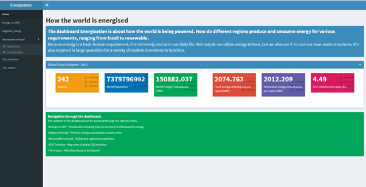
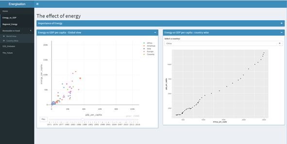
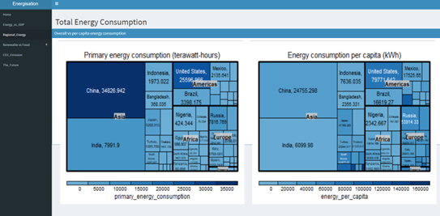
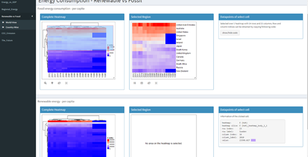
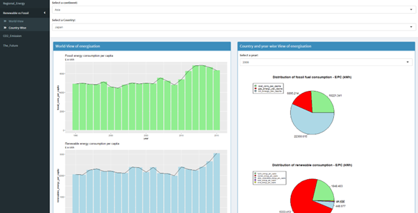
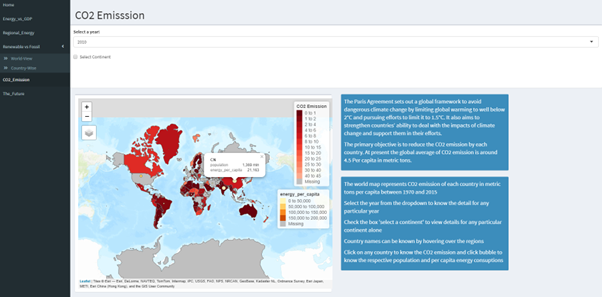
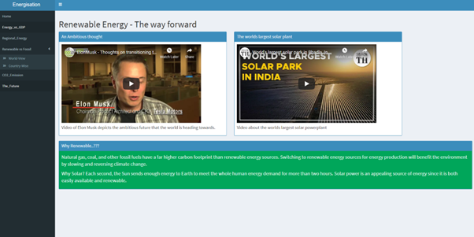

# Data-Visualisation-in-R
Visualisation of world energy consumption dataset using R Shiny Dashboard. 
The visualisation for this data was performed using R programming language version 4.1.1, implementing a Shiny application dashboard.

**Introduction**

Energy as a form is extremely significant in today's world for all human needs. Everything takes energy in some form or another, from powering our homes to moving around in automobiles. If the globe is without energy for a day, it might have disastrous consequences.

The aim of this project is to look through the world's energy data and visualise the key takeaways in order to get valuable insights.

**Introduction to the datasets**

**Primary Dataset**
The primary dataset used in this dashboard is World Energy Consumption from Kaggle which is a collection key metrics from our world in data. The dataset comprises 122 variables that detail the different types of energy produced and consumed by different countries over the last century.
Only a few variables are utilized in this visualisation, and only data from 1970 to 2015 was investigated.

**Secondary datasets**
The analysis depends on two secondary datasets: one that has per capita carbon-dioxide emission statistics for each country during the last five decades, and the other that contains information on country and continent mapping.

**Dashboard Structure**

**Home Page**
The home screen provides few interesting datapoints, in the form of info box, from the data set that the dashboard was developed upon like number of countries, total world population, CO2 emission level excreta.

**Tab 1**

The potential of a country to grow is largely determined by how well it is energised, and how self-sufficient it is in terms of energizing its citizens homes, industries excreta. “A 1% increase in energy consumption increases real GDP by 0.59%”. 

The first graph is an interactive scatter plot between per capita GDP and get capita energy consumption of the past five decades. The time-series representation proves the point of the dependency between the variables.
The plot 2 is a static scatter plot visualising the same variables country-wise.

**Tab 2**

**Tab 3**

**Tab 4**

**Tab 5**

**Tab 6**

